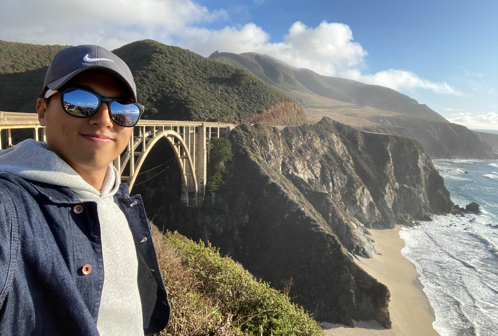

<!-- 


TeXt is a super customizable Jekyll theme for personal site, team site, blog, project, documentation, etc. Similar to iOS 11 style, it has large and prominent titles, round buttons and cards.

```javascript
(() => console.log('Hello, World!'))();
```

## Features

- Responsive
- Semantic HTML
- Skins
- Highlight Theme
- Internationalization
- Search
- Table of contents
- Authors
- Additional styles (alert, tag, image, icon, button, grid, etc)
- Extensions (audios, videos, slides, demos)
- Markdown enhancements ([MathJax](https://www.mathjax.org/), [mermaid](https://mermaidjs.github.io/), [chartjs](http://www.chartjs.org/))
- Sharing ([AddToAny](https://www.addtoany.com/), [AddThis](https://www.addthis.com/))
- Comments ([Disqus](https://disqus.com/), [Gitalk](https://gitalk.github.io/), [Valine](https://valine.js.org/en/))
- Pageview ([LeanCloud](https://leancloud.cn/))
- Analytics ([Google Analytics](https://analytics.google.com/analytics/web/))
- RSS ([jekyll-feed](https://github.com/jekyll/jekyll-feed))

## Skins

TeXt has 6 built-in skins, you can also set up your own skin.

| `default` | `dark` | `forest` |
| --- |  --- | --- |
|  |  |  |

| `ocean` | `chocolate` | `orange` |
| --- |  --- | --- |
|  |  |  |

### Highlight Theme

TeXt use [Tomorrow](https://github.com/chriskempson/tomorrow-theme) as the highlight theme.

| `tomorrow` | `tomorrow-night` | `tomorrow-night-eighties` | `tomorrow-night-blue` | `tomorrow-night-bright` |
| --- |  --- | --- | --- |  --- |
|  |  |  |  |  | -->


<br/>


<div class="item">
  <div class="item__image">
    
  </div>
  <div class="item__content">
    <div class="item__header">
      <h4>Hello! I'm Younghyo Park.</h4>
    </div>
    <div class="item__description">
      <p>I'm currently undergoing a B.S. course in Seoul National University, majoring in Mechanical Engineering.
I'm interested in <b>Robotics, Control and Machine Learning</b>. 
Besides that, I love traveling, playing piano and learning new stuffs.</p>
    </div>
  </div>
</div>

### <i class="fas fa-graduation-cap"></i>  Education
  - **2016 Mar - 2022 Feb** B.S. degree in Mechanical Engineering, Seoul National University [\[Courseworks\]](/courseworks)
    - GPA : Total 4.25 / 4.3, Major 4.25 / 4.3
    - Served Mandatory Military Service (2018 Mar - 2019 Dec)

  - **2014 Mar - 2016 Feb** Gyeonggi Science High School for the Gifted 


### <i class="fas fa-microscope"></i> Research Experiences
- **2021 Mar - 2021 Dec** [Interactive & Networked Robotics Laboratory](https://www.inrol.snu.ac.kr), Seoul National University 
  - Topic : 

- **2020 Sep - 2021 Aug** [Robotics Laboratory](https://sites.google.com/robotics.snu.ac.kr/fcp/), Seoul National University 
  - Topic : Robot Collision Detection using Unsupervised Anomaly Detection Algorithm (Advisor Frank C. Park) [\[Summary\]]()
- **2020 Jul - 2021 Jan** [Saige Research](https://saigeresearch.ai), Machine Learning Research Intern
  - Topic : Developing Out-of-Distribution Image Detection Algorithm for Industrial Images [\[Summary\]](/saige)


### <i class="fas fa-pencil-alt"></i> Publications
- **Younghyo Park**, Jaehyeok Bae and Jinwoo Lee. **Design of a Perforated Panel for Transmission Noise Reduction**, Transactions of the Korean Society of Mechanical Engineers, 2015


### <i class="fas fa-chalkboard-teacher"></i> Teaching Experience
- **2020 Sep - 2020 Dec**, Undergraduate Tutor, Dynamics / Fluid Dynamics / Introduction to Robotics
- **2020 Mar - 2020 Jun**, Undergraduate Tutor, Solid Mechanics

### <i class="fas fa-globe-americas"></i> English Proficiency
- **TOEFL** 114/120 (2021)
- **GRE** 164/170/4.0 (2020)


### <i class="fas fa-coins"></i> Scholarship
- **2016 Mar - 2021 Feb**, National Science& Technology Scholarship (4-year Full Tuition)

### <i class="fab fa-python"></i> Skills
- **Programming**: Python, PyTorch, MATLAB
- **Software & Tools**: Linux, Latex
- **Modeling and Analysis**: SolidWorks, COMSOL
- **Languages**: Korean (native), English 


<!-- Celeste is a lightweight Jekyll theme that features a minimalist, content-first design. It places your content center stage and lets your readers view them in a clutter-free environment without visual distractions. It is based on [Poole](https://github.com/poole/poole), the Jekyll butler, by [@mdo](https://twitter.com/mdo).

In addition to using Poole as its foundation, Celeste is also built using the following open-source projects:

* [normalize.css](http://necolas.github.io/normalize.css/), a modern, HTML5-ready alternative to CSS resets.
* [Font Awesome](https://fontawesome.com/v4.7.0/), the iconic font and CSS toolkit.
* [Hover.css](http://ianlunn.github.io/Hover/), a collection of CSS3 powered hover effects.

Celeste is <i class="fa fa-code"></i> with <i class="fa fa-heart"></i> by [@nicoelayda](https://github.com/nicoelayda). Learn more and contribute on [GitHub](https://github.com/nicoelayda/celeste).

Have questions or suggestions? Feel free to [open an issue on GitHub](https://github.com/nicoelayda/celeste/issues/new) or [ask me on Twitter](https://twitter.com/nicoelayda).

Thanks for reading! -->
  