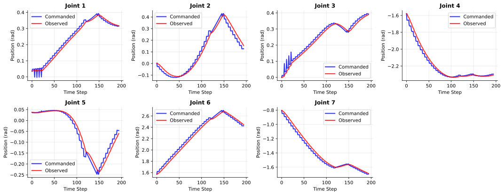
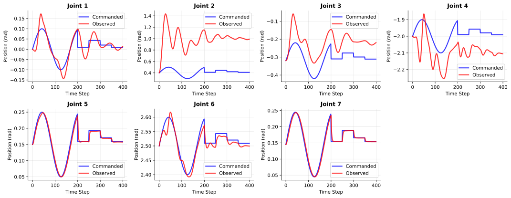
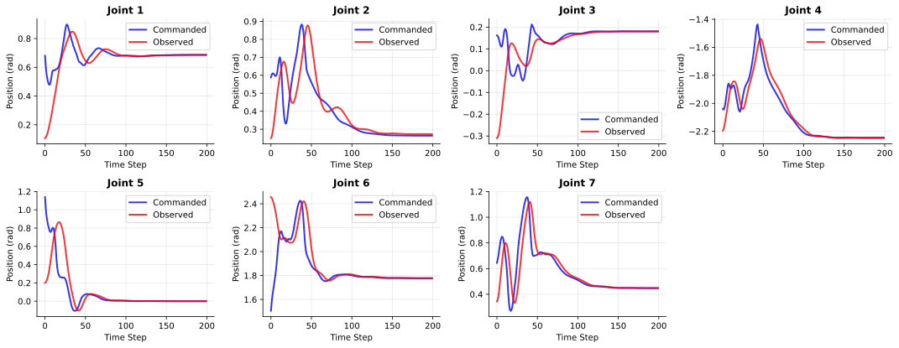

Okay, I feel lost. Where am I now? 

I was personally very invested in answering these two questions:  
1. How far are we from sim-to-real-ing a state-based manipulation policy, trained from scratch, to a real-world executable RGB-based policy without any performance drop? 
2. If compensating for such drop in performance inevitably requires a real-world data, what kind of data from real-world should be collected and how should it be used? Can a simple recipe like co-training be the ultimate solution, or should someone use the real data to sysID the cameras or systems better in simulation? 

Sim-to-real gap, however, is a complicated interplay between these three things, (a) joint dynamics gap, (b) contact dynamics gap, (c) visual appearance gap, which causes the sim-to-real studies to be often hard to understand and analyze. While all of these gaps individually warrants an individual investigation, we specifically wanted to study how the last component -- visual gap -- and how it affects the sim2real. Why? Cuz, in my opinion, that's the part the community is kind of lost at this moment, and has some unwarranted fear towards. 

# Isolating the Visual Gap from the others

We wanted to build from the ground up, **isolating the visual gap from the other two gaps**. To do so, we aimed to train a state-based policy that had (a) zero gap coming from joint-level dynamics, (b) zero gap coming from contact-level dynamics so we can study the visual sim2real component in isolation. How can we do that? We needed a state-based policy that achieves no performance drop in real world. 

For a simple object picking task, getting there was pretty easy. We generated the dataset using a simple motion planning. The data was simple and clean. At a given joint state and object pose, the action labels were simply a smooth interpolation between the current state and the target grasp pose. Look how close the joint position action targets are to the current joint positions! 

With this dataset, we trained a BC policy -- and with a few trial and error, we were able to deploy the state-based BC policy in real-world with decent success rate, practically no performance drop. I mean, it's not a huge news at all (and it shouldn't be), but hey, that's what we exactly wanted. But it's not like we properly SysID-ed the real world (i.e., object friction, restitution, etc. for the contact dynamics / motor gains, friction, inertia, etc for the joint-level dynamics) or domain randomized the parameters properly in simulation -- the behavior we've generated with motion planning just did not exploit too much of the dynamics in the system, so the effect of those unmodeled dynamics gap could be minimized. 

It was a blissful ignorance -- without caring too much about getting the system dynamics exactly correct, we were able to get a policy that does not suffer from neither joint-level dynamics gap nor contact-level dynamics gap. That means, whatever transfer that happens after this point -- it can all be attributed to the visual gap. So we were able to study some visual sim2real aspects in isolation using this model and data. We first tried to gather some insights about camera extrinsic poses. It turns out -- getting the extrinsics right really does matter a lot, even more than we thought, but there were some confusing signals that warranted more experiments on different tasks. 
 
# Expanding Tasks via RL 

So we wanted to expand on more tasks. We basically needed more data points, and for me personally, I desparately wanted to do something more exciting than "picking up a damn block". Obviously, motion planning didn't get us pretty far. I mean, it's not like we didn't try -- we tried. We tried to design behaviors with motion planning for mug hang, bimanual handover, bimanual object lift. But once there's more contacts involved -- which means -- things can go wrong more often and more frequently and thus require more reactive planning -- naive motion planning began to suck really quick. We then casualy decided to use reinforcement learning as a behavior generation tool.  
> In hindsight -- we didn't have to. For the sake of getting the behaviors with no joint/contact dynamics gap as fast as possible, we could have invested more effort in making either the motion planning algorithm more reactive and robust, or used my own brain child DART and just collect teleop demonstrations in simulation.  But the major reason we inclined to using reinforcement learning as a behavior generation method was more coming from a bigger context in the robot learning community: in the context of real world data collection and behavior cloning dominating the robot manipulation learning space, the whole concept of doing sim2real for manipulation only make sense when it's a superhuman behavior that cannot be generated from teleoperating a robot in real world. Doing RL in simulation, was practically the only proven way to generate such behaviors. 

<!-- All things aside, we just decided to use RL cuz we wanted to. But that opened up a huge can of worms. The unmodeled sim2real gap coming from the joint dynamics, now started to play a huge role. We basically verified this by  -->

## RL prefers compliance for position controllers.

Our controller settings for both real-world and motion planning controller was quite stiff, and it was set like that for a reason. First of all, motion planning critically relies on a well tracking position controller: we had to bump up the gains pretty high for position controllers in simulation to increase the success rate of motion planned trajectories. Same goes for real world robot setting as well; since we've tuned the real robot for people collecting data through teleoperation, we've made the real world controller to be pretty stiff there as well. Since we were able to sim-to-real (at least in state space) for a stiff controller setting, we naively decided to use the same controller setting -- a super stiff one -- for real world as well. But it really struggled to learn useful behaviors compared to a compliant setting. 

In fact, the default gain settings in Isaac's FR3 USD configurations are so compliant -- almost to a point where it loses the physical meaning of *joint position **targets***. 

## Compliant controllers are harder to Sim-to-Real

- 

## Action space matters 

In fact, this is what the joint-level trajectories look like: 

