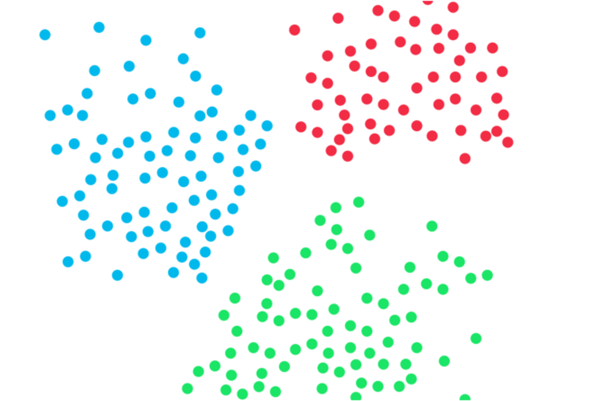
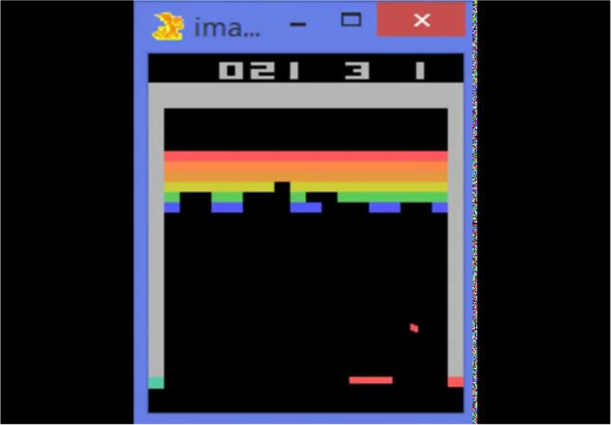
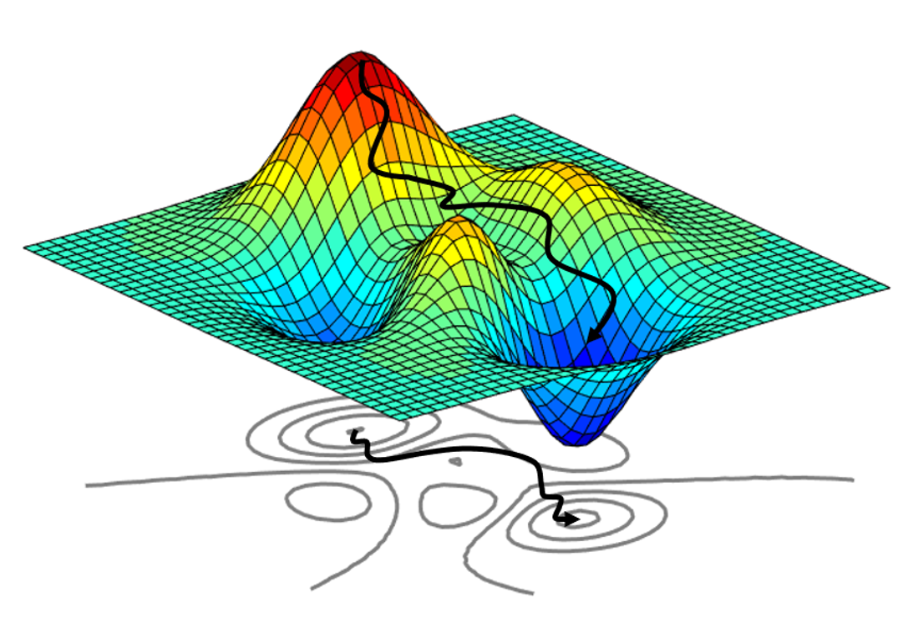
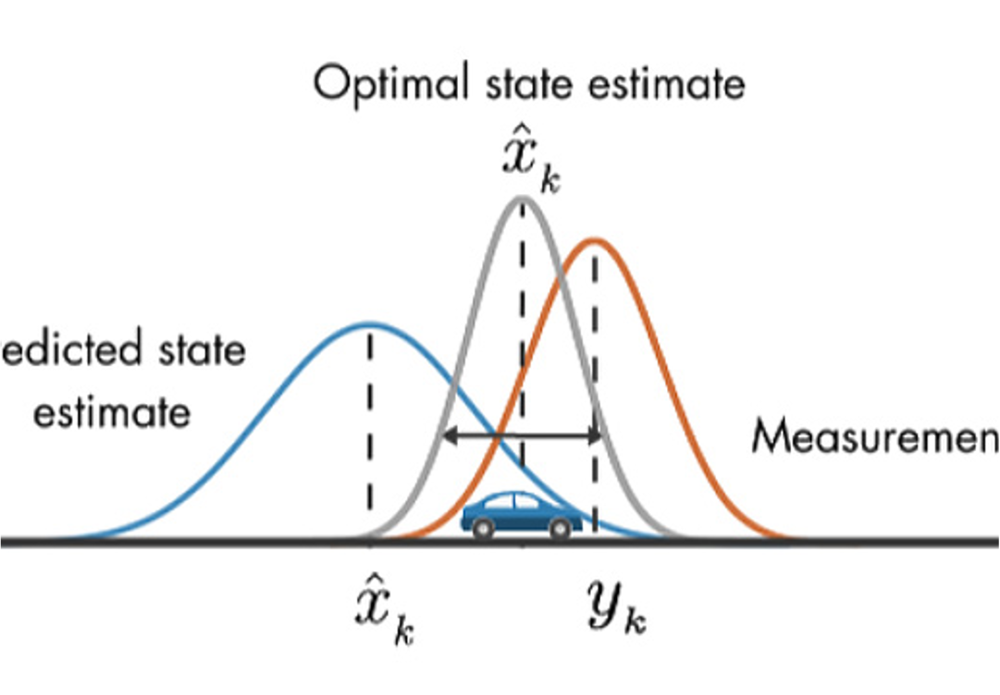
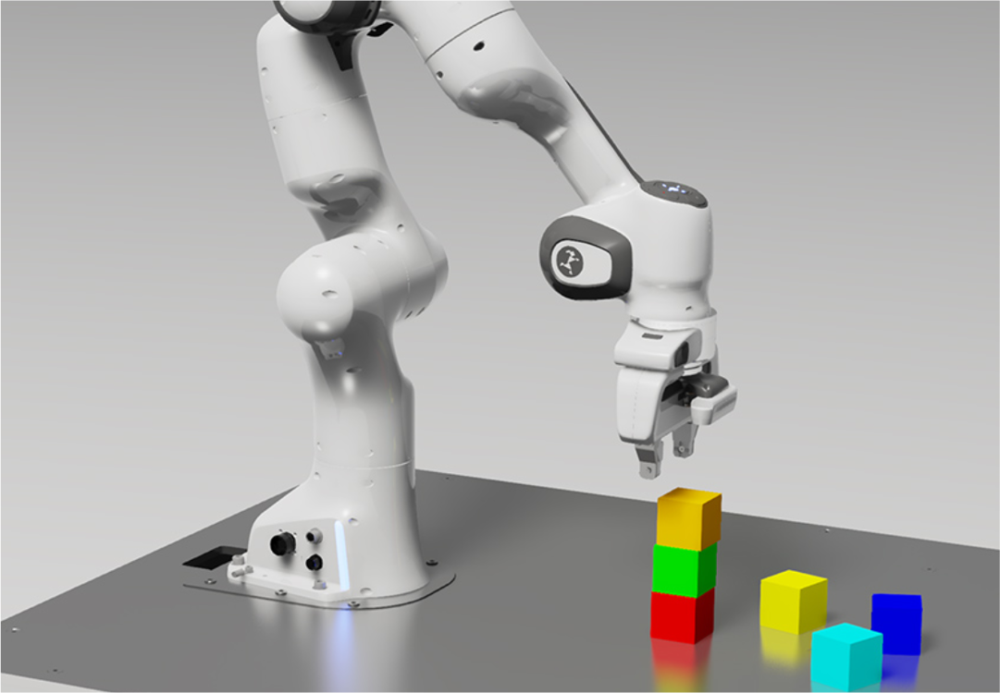
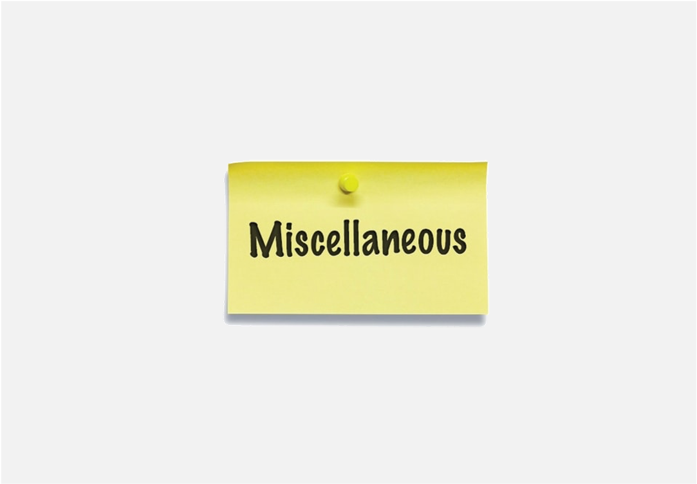

 

    <a href="./ml-summary">
    
 
        

        

          

            
          

          

            

              <h4>Machine/Deep Learning</h4>
            

          

        

        

    
</a>
    <a href="./rl-summary">
    
 
        

        

          

            
          

          

            

              <h4>Reinforcement Learning</h4>
            

          

        

        

    
</a>

 

    <a href="./optimization">
    
 
        

        

          

            
          

          

            

              <h4>Optimization</h4>
            

          

        

        

    
</a>
    <a href="./control-summary">
    
 
        

        

          

            
          

          

            

              <h4>Control Theory</h4>
            

          

        

        

    
</a>

 

    <a href="./robotics-summary">
    
 
        

        

          

            
          

          

            

              <h4>Robotics</h4>
            

          

        

        

    
</a>
    <a href="./control-summary">
    
 
        

        

          

            
          

          

            

              <h4>Miscellaneous</h4>
            

          

        

        

    
</a>

 

<!-- ### Optimization
- [Convex Optimization and Applications - Lecture Summary (2021 SNU EE)](./optimization)

### Reinforcement Learning
- [Stochastic Control and Reinforcement Learning - Lecture Summary (2021 SNU EE)](./rl-summary)

### Machine Learning
- [Pattern Recognition and Machine Learning - Self Study](./prml)

### Computer Vision
- [Computer Vision - Lecture Summary (2020 SNU EE)](./computer-vision)

### Control
- [Control - Lecture Summary (2020 SNU ME)](./computer-vision) -->